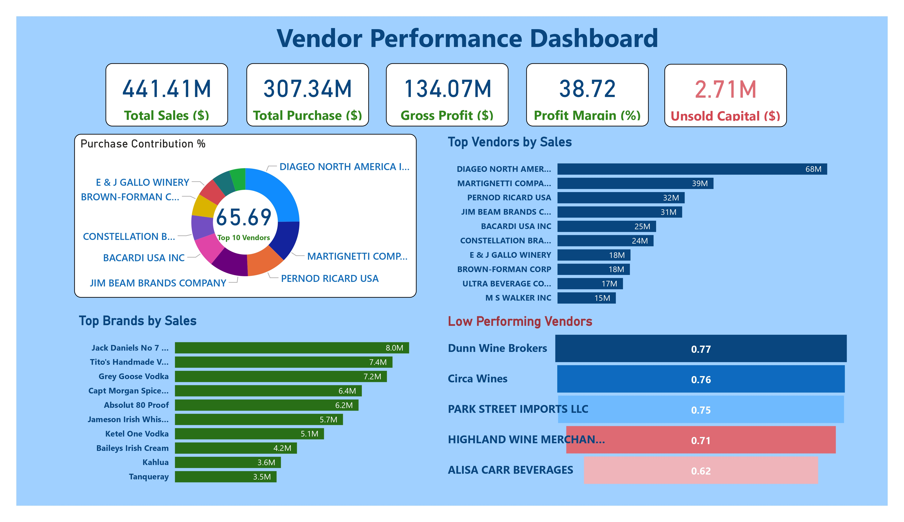
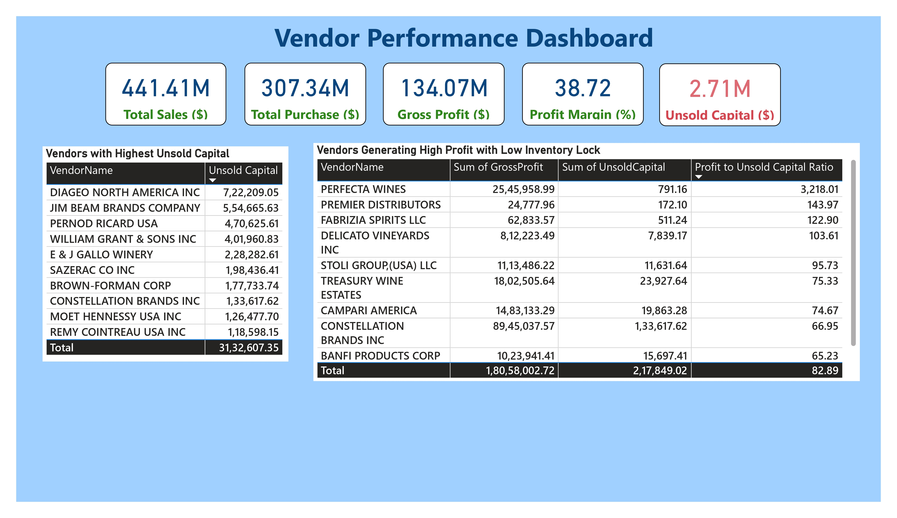

# 📦 Vendor Performance Analysis – Improving Procurement Efficiency for a Retail Chain

## 🧠 Executive Summary

This project analyzes vendor-level sales and purchase data to evaluate performance efficiency across a retail procurement system. Using SQL, Python, and Power BI, I studied key metrics such as:

- 📊 **Gross Profit**
- 💰 **Profit Margin**
- 🔁 **Stock Turnover**
- 🔄 **Sales to Purchase Ratio**
- 📦 **Unsold Capital**
- 📌 **Profit-to-Unsold Capital Ratio**

The objective was to identify which vendors drive the most profit, which block working capital, and where bulk purchasing leads to cost savings. Key findings include:

- A **99.9% correlation** between purchase and sales quantity (efficient inventory turnover).
- Bulk orders **reduce per-unit cost by ~72%**, leading to increased profitability.
- Some low-performing vendors showed **higher margins but poor sales**, pointing toward pricing or promotional gaps.

---

## 🎯 Project Background & Objectives

Many retail businesses struggle with identifying the vendors who deliver true value. It's not always about who sells the most—but **who sells profitably, with minimal capital blockage**.

This analysis was framed around the following questions:

- Which vendors offer the **highest returns on inventory investment**?
- Are there vendors with **high unsold inventory**, affecting working capital?
- Can **bulk purchase strategies** improve cost-efficiency?
- Do **high-profit-margin vendors always generate high sales**?

The ultimate goal: Enable **data-backed vendor negotiation** and inventory decisions.

---

## 🗂️ Dataset Description

The dataset is inspired by procurement data for a mid-sized retail company. It contains **vendor-wise transactional summaries** and KPIs.

### Key Tables:

| Table Name             | Description |
|------------------------|-------------|
| `vendor_sales_sum`     | Aggregated sales, profit, and cost data per vendor. |
| `PurchaseContribution` | Total purchase share (%) by vendor. |
| `LowTurnoverVendor`    | Vendors with low inventory turnover and excess stock. |
| `UnsoldCapital`        | Estimated value of inventory that hasn’t yet been sold. |

---

## 🛠️ Tools & Technologies

| Tool | Purpose |
|------|---------|
| **SQL (PostgreSQL)** | To aggregate sales, purchase, and performance metrics by vendor. |
| **Python (Pandas, Matplotlib)** | For exploratory data analysis, correlation checks, and hypothesis testing. |
| **Power BI** | To build interactive dashboards and present actionable insights. |
| **Excel** | Used for quick summaries and QA of final outputs. |

---

## 🔍 Analysis & Insights

### 📈 Correlation Insights:
- Purchase price had **weak correlation** with total sales and gross profit → pricing may not be the key sales driver.
- **Negative correlation** between profit margin and sales price → possibly due to competitive underpricing.

### 📉 Inventory Efficiency:
- Some vendors had **high unsold capital** with **low turnover**, pointing to overstocking.
- Vendors with **low profit-to-unsold capital ratio** were flagged as inefficient—good leads for renegotiation or delisting.

### 🧪 Hypothesis Testing:
> Is there a significant difference in profit margins between top and low-performing vendors?

- T-statistic: `-17.67`, P-value: `< 0.001` → **Statistically significant** difference found.
- Low-performing vendors had **higher average profit margins**, likely due to premium pricing but **lower sales volume**.

---

## 📊 Visualizations

An interactive Power BI dashboard was built with:

- **Top Vendors by Gross Profit & Purchase Volume**
- **Vendors with Highest Unsold Capital**
- **Profit to Unsold Capital Ratio Table**
- **Confidence Intervals for Profit Margins**
- Drilldowns by Brand, Volume, and Order Size categories

> Visuals were chosen to support executive decisions and avoid clutter — each tile answers a business-relevant question.

---

## 🖼️ Sample Dashboards

### 🔹 Page 1 – Vendor Profitability & Inventory Overview

### 🔹 Page 2 – Inventory Efficiency & Capital Blockage

---

## ✅ Recommendations

Based on insights:

- 🧾 **Procurement Team**: Should prioritize bulk purchases from vendors offering low per-unit cost and high turnover.
- 📉 **Inventory Managers**: Flag vendors with excess unsold inventory for cycle audits or demand reviews.
- 📈 **Sales/Marketing**: Promote high-margin but low-sales vendors more aggressively or revisit pricing strategies.
- 💬 **Vendor Negotiation**: Leverage the profit-to-capital ratio as a metric during annual reviews or renegotiations.

---

## 📁 Technical Assets

📂 `/notebooks` – Python notebooks with all EDA, correlation, and hypothesis testing logic  
📂 `/powerbi` – Power BI `.pbix` file for the dashboard  
📂 `/screenshots` – Report Previews

---

## 👀 Highlight Insight

One of my favorite insights:  
> Vendors making **bulk purchases** paid **~72% less per unit** compared to small orders — **a strong validation of bulk discount strategies**, especially when paired with solid stock turnover. This insight could directly lead to **procurement policy changes**.

---

Thanks for checking this project out!  
Feel free to [connect with me](#) if you’d like to discuss the analysis or offer feedback.
